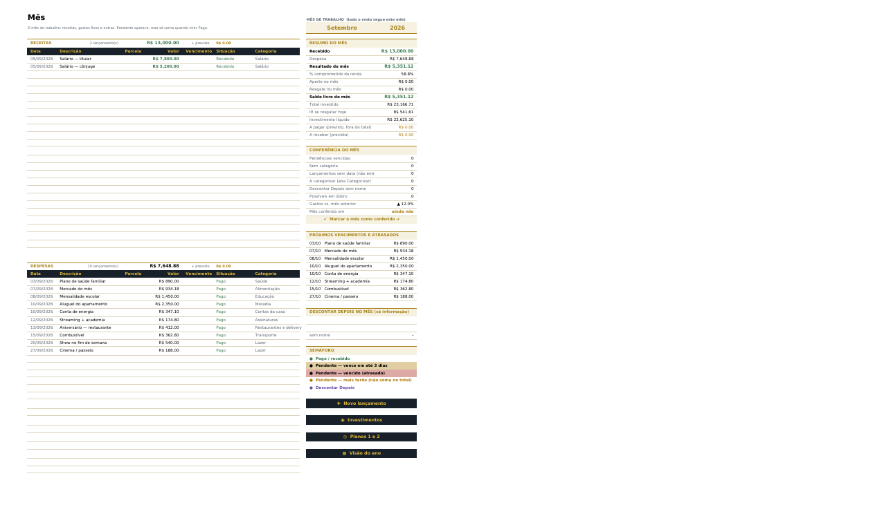
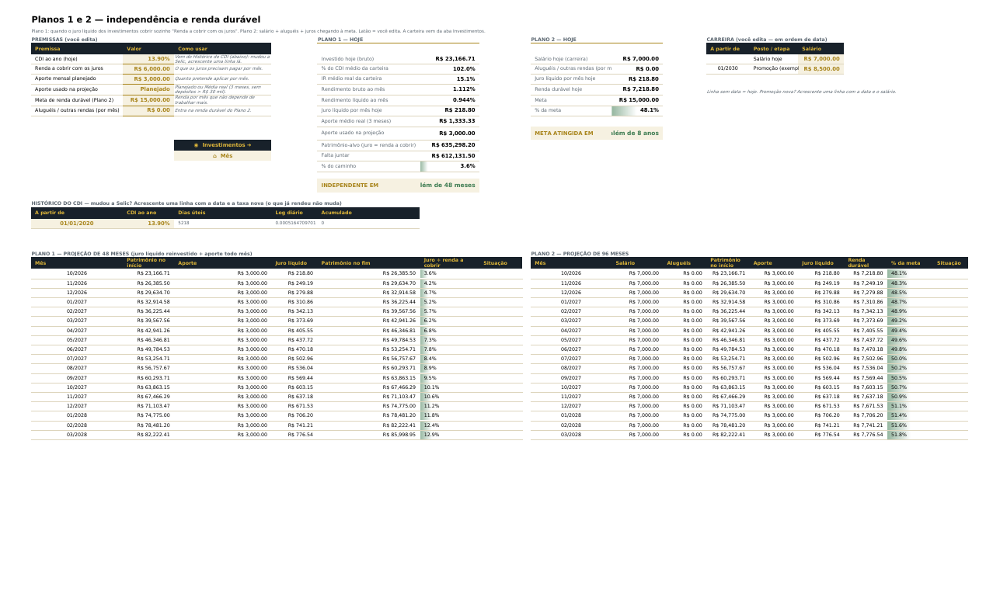

# Finanças Pessoais — Central da Família

*(imagens feitas com os dados de exemplo)*

## O dia a dia

| Aconteceu | O que fazer |
|---|---|
| Gastou ou recebeu | Em **Lançamentos**, clique em **✚ Lançar algo novo**: Data (`Alt+↓` Enter = hoje), Descrição e Valor. O resto se preenche. |
| Pagou uma conta | Na aba **Mês**, clique no **✎** da linha: você cai na Situação dela em Lançamentos. Troque para **Pago** e volte pelo **📒 Mês**. (Ou use a lista de Pendentes no topo de Lançamentos.) |
| Compra parcelada | Lance só a 1ª parcela com `1/10` na coluna Parcela. As outras entram como Pendente na próxima atualização. |
| Descontar de alguém | Situação **Descontar Depois** e o nome em **Descontar de**. A aba Mês mostra quanto ficou para cada pessoa (só informação). |
| Aplicou | Uma linha em **Investimentos**: Data, Banco, % do CDI e Aplicado. |
| Mudou a Selic | Uma linha no **Histórico do CDI**, na aba Planos. O que já rendeu não muda. |
| Quer mudar algo na planilha | Escreva o pedido em **Correções IA**. |

## Abas

| Aba | Para que serve |
|---|---|
| **Mês** | O mês de trabalho: receitas, gastos fixos e extras, resumo, conferência, próximos vencimentos, Descontar Depois por pessoa e semáforo. **É aqui que se troca o mês.** |
| **Correções IA** | Os seus pedidos: você escreve, a IA implementa, marca **FEITO ✔** e explica em **Como ficou**. |
| **Lancamentos** | Tabela `tbLancamentos`. No topo, o que está Pendente até o fim do mês que vem; depois 20 linhas em branco para lançar; depois o histórico, do mais recente para o mais antigo. |
| **Investimentos** | Potes 80/10/7/3 (guardado × gasto) no topo e, embaixo, uma linha por aplicação, com saldo, IR e líquido calculados todo dia. |
| **Planos** | Premissas, Histórico do CDI, Plano 1 (independência pelos juros, 48 meses) e Plano 2 (renda durável: carreira + aluguéis + juros, 96 meses). |
| **Visão do ano** | Só consulta: orçamento do mês, o ano por categoria (com minigráficos) e o histórico de todos os meses (**Conferido em**). |
| **Categorizar** | Temporária: o que ainda está em Outros/Sem categoria, por descrição. |
| **Atalhos** | Favoritos / mapa Descrição → Tipo, Categoria e Pote. **Recorrente? = sim** marca as contas fixas. |
| Config, Calc (ocultas) | Listas editáveis e cálculos auxiliares. |

## No jeito do Plínio

- **Tema claro do Plínio:** fundo branco, letra preta, cabeçalhos em tinta com **latão**, **sereno** (verde) e **brasa** (vermelho). Células em latão são as que você edita. O visual escuro continua em `--tema plinio_escuro`.
- **Regra dos totais:** entra no mês o que tem **Conta no mês? = sim**, ou seja, receita *Recebida* e gasto *Pago* ou *Descontar Depois*. *Pendente*, *Investimento* e parcelas projetadas ficam fora. Não há saldo acumulado; o que vale é o **Saldo livre do mês** = Resultado − Aporte + Resgate.
- **Aporte** = aplicações novas da aba Investimentos no mês, sem "Reaplicação" e sem linha de "correção". Confere com a Tela do Dinheiro.
- **Categoria ≠ Pote:** a categoria diz *com o quê*; o pote diz *de qual dinheiro*. Um gasto sem pote recebe o **Fundo padrão** da categoria.
- **Contas fixas e parcelas previstas:** a cada atualização entram como Pendente as contas dos favoritos com Recorrente? = sim, para o mês atual e o seguinte. Entram só as que aparecem uma vez por mês; supermercado, Uber e afins ficam de fora. Entram também as parcelas restantes de compras parceladas recentes. Uma prevista que ficou sobrando, porque você lançou a conta numa linha nova, é retirada.
- **Investimentos:** cada aplicação rende pelo **Histórico do CDI** × % do CDI em dias úteis, com IR regressivo (22,5% até 180 dias → 15% após 720). As linhas vindas do app partem da posição calculada pelo app (**Base**).

## Arquivos

- **`build_planilha.py`**: gera a planilha do zero (`pip install openpyxl`).
  - `python build_planilha.py --dados Financas_Plinio_AAAA-MM-DD.xlsx` importa a exportação do app.
  - `python build_planilha.py --dados Financas_Pessoais_Dashboard.xlsx` gera uma **versão nova a partir da própria planilha**. Mantém lançamentos, favoritos, potes, correções IA, respostas da aba Categorizar, meses conferidos, orçamento, premissas, CDI e carreira dos Planos e investimentos.
  - `python build_planilha.py` sem dados gera **`Financas_Pessoais_Dashboard_EXEMPLO.xlsx`** (dados fictícios).
  - Opções: `--tema plinio` (padrão), `plinio_escuro`, `escuro` ou `claro`; `--saida Nome.xlsx`.
- Os valores pessoais ficam em `config_pessoal.json`: pessoas, potes, premissas dos Planos e sugestões para Categorizar. Ele fica fora do git, porque o repositório é público, assim como a planilha com dados reais e a exportação do app.

## Detalhes técnicos

- `.xlsx` sem macros. As fórmulas estão em inglês, e o Excel em português as traduz.
- Funções compatíveis: SUMIFS, SUMPRODUCT, INDEX/MATCH, SMALL/LARGE em fórmula matricial, LOOKUP, IFERROR, OFFSET, NETWORKDAYS. Nada de matriz dinâmica.
- Verificação feita com os dados reais:
  - **Recálculo:** no LibreOffice, nenhuma das 16.831 fórmulas dá erro.
  - **Histórico:** bate com o "Resumo por mês" do app nos 54 meses. As únicas diferenças são correções pedidas depois da exportação: a conta de gás de julho paga e as linhas lançadas em setembro.
  - **Descontar Depois de set/2026:** o total por pessoa confere com os acertos do app.
  - **Selic nova:** uma taxa nova no Histórico do CDI não muda o saldo já conquistado.
  - **Atualizar duas vezes seguidas:** não duplica contas previstas nem parcelas.
