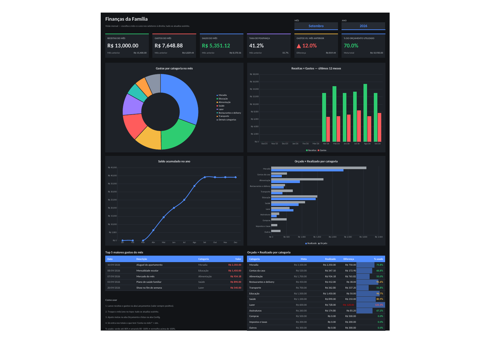

# Finanças Pessoais — Planilha com Dashboard

*(imagem feita com os dados de exemplo)*

## Arquivos

- **`build_planilha.py`**: gera a planilha do zero (`pip install openpyxl`).
  - `python build_planilha.py --dados Financas_Plinio_AAAA-MM-DD.xlsx` importa os dados exportados pelo app e gera **`Financas_Pessoais_Dashboard.xlsx`**.
  - `python build_planilha.py` sem dados gera **`Financas_Pessoais_Dashboard_EXEMPLO.xlsx`**, com dados fictícios.
  - Outras opções: `--tema claro` e `--saida NomeDoArquivo.xlsx`. A paleta de cores fica no topo do script.
- **`Financas_Pessoais_Dashboard_EXEMPLO.xlsx`**: a mesma planilha com dados fictícios.

A planilha com dados reais e o arquivo exportado do app **não vão para o git** (estão no `.gitignore`), porque contêm dados financeiros pessoais.

Todos os números (Dashboard, Orçamento, Anual, Histórico) são fórmulas do Excel. Você só lança as transações.

## Abas

| Aba | Para que serve |
|---|---|
| **Dashboard** | Indicadores do mês, 4 gráficos, Top 5 maiores gastos e orçado × realizado. |
| **Lancamentos** | Onde você lança receitas, gastos e investimentos (tabela `tbLancamentos`). |
| **Orcamento** | Meta mensal por categoria de gasto e quanto já foi usado no mês escolhido. |
| **Anual** | Categorias × 12 meses do ano escolhido, com total, média e minigráficos. |
| **Historico** | Todos os meses desde o primeiro lançamento: receitas, gasto fixo, gasto extra, resultado e taxa de poupança. |
| **Metas** | Metas de poupança e parcelamentos em andamento. |
| **Investimentos** | Aplicações importadas do app, com o total da carteira (só aparece quando há dados importados). |
| **Acertos** | Valores a cobrar de outras pessoas, com o rateio passo a passo (só aparece quando há dados importados). |
| **Config** | Listas editáveis: categorias, potes, contas, cartões, formas de pagamento, tipos, situações e anos. |
| Calc (oculta) | Cálculos auxiliares dos gráficos. Não precisa mexer. |

## Regra que decide o que entra nos totais

A coluna **Conta no mês?** é calculada sozinha e segue a mesma regra do app:

- **sim** para receita *Recebida* e para gasto *Pago* ou *Descontar Depois*. Uma linha com a Situação em branco também conta.
- **não** para *Investimento*, *Pendente* e parcelas projetadas.

O mês de cada lançamento vem da **Data**. Se ele pertence a outro mês (por exemplo, um salário que cai no dia 31 mas é do mês seguinte), preencha a coluna **Competência** com esse mês.

Com os dados importados, a aba Histórico reproduz, centavo por centavo, o "Resumo por mês" do app nos 54 meses com dados.

## Como lançar uma transação

1. Na aba **Lancamentos**, clique na primeira linha vazia logo abaixo da tabela.
2. Preencha **Data**, **Descrição**, **Tipo** (Receita, Gasto Fixo, Gasto Extra ou Investimento), **Categoria** e **Valor**. Se quiser, preencha também **Pote**, **Conta**, **Forma de pagamento** e **Situação**, que têm lista suspensa.
3. O valor é **sempre positivo**: é o Tipo que diz se o dinheiro entrou ou saiu.
4. **Mês**, **Ano** e **Conta no mês?** são preenchidos sozinhos. A tabela cresce e tudo se atualiza.

## Como trocar o mês do Dashboard

No topo do **Dashboard**, escolha o mês na lista **MÊS** e o ano na lista **ANO**. O Dashboard, a aba Orçamento e a aba Anual seguem essa seleção.

## Como adicionar uma categoria (ou pote, conta, cartão, forma de pagamento)

1. Na aba **Config**, digite o novo item na primeira linha vazia logo abaixo da tabela certa.
2. A tabela cresce sozinha e o item já aparece nas listas suspensas de Lançamentos.
3. Para uma categoria de **gasto** ter meta, adicione também uma linha na aba **Orcamento**.

Observações:
- A aba Anual tem 2 linhas livres para receitas novas e 3 para gastos novos.
- O gráfico de rosca mostra as 7 maiores categorias do mês, e as demais aparecem somadas.
- A tabela e o gráfico de barras do Dashboard mostram as categorias do orçamento que existiam quando a planilha foi gerada. Para incluir categorias novas neles, gere a planilha de novo.

## Sobre a importação dos dados reais

- **Categorias em branco:** as linhas sem categoria recebem a categoria mais usada para a mesma descrição no histórico, com a Observação "categoria sugerida pelo histórico". Quando não há nenhum histórico para a descrição, a linha fica como **Sem categoria**. Filtre por essas duas para revisar.
- **Metas do orçamento:** começam na média mensal dos gastos de cada categoria nos últimos 12 meses, arredondada para cima em múltiplos de R$ 50.
- **Parcelamentos:** os que estão em andamento no último mês vão para a aba **Metas**, na tabela de dívidas.
- **Investimentos:** as colunas *Saldo hoje*, *IR* e *Líquido* são a posição calculada pelo app no dia da exportação. Elas são valores fixos e **não se atualizam sozinhas**. Os totais ao lado são fórmulas.
- **Contas e cartões:** a Config traz uma lista inicial (bancos da aba Investimentos e cartões citados nas descrições). Ajuste como quiser. Os lançamentos antigos não tinham conta nem forma de pagamento.

## Como apagar os dados de exemplo (só no arquivo `_EXEMPLO`)

Os lançamentos fictícios têm **"EXEMPLO"** na coluna **Observação**. Filtre essa coluna por `EXEMPLO`, selecione as linhas visíveis, clique com o botão direito e escolha **Excluir linha**.

## Detalhes técnicos

- Arquivo `.xlsx` sem macros. As fórmulas estão gravadas em inglês, e o Excel em português as traduz ao abrir.
- Usa só funções compatíveis (SUMIFS, INDEX/MATCH, LARGE, IFERROR, DATE, OFFSET), sem funções de matriz dinâmica.
- Intervalos nomeados: `Categorias`, `Contas`, `FormasPagamento`, `MesSelecionado`, `AnoSelecionado`, `Meses`, `Tipos`, `Situacoes`, `Potes`, `Anos`, `CatReceita`, `CatDespesa`.
- Verificação: depois do recálculo no LibreOffice, nenhuma das 11.948 fórmulas da planilha com dados reais dá erro. Os KPIs e o Top 5 conferem com os dados originais em set/2026, ago/2026, dez/2025 e mar/2023.
