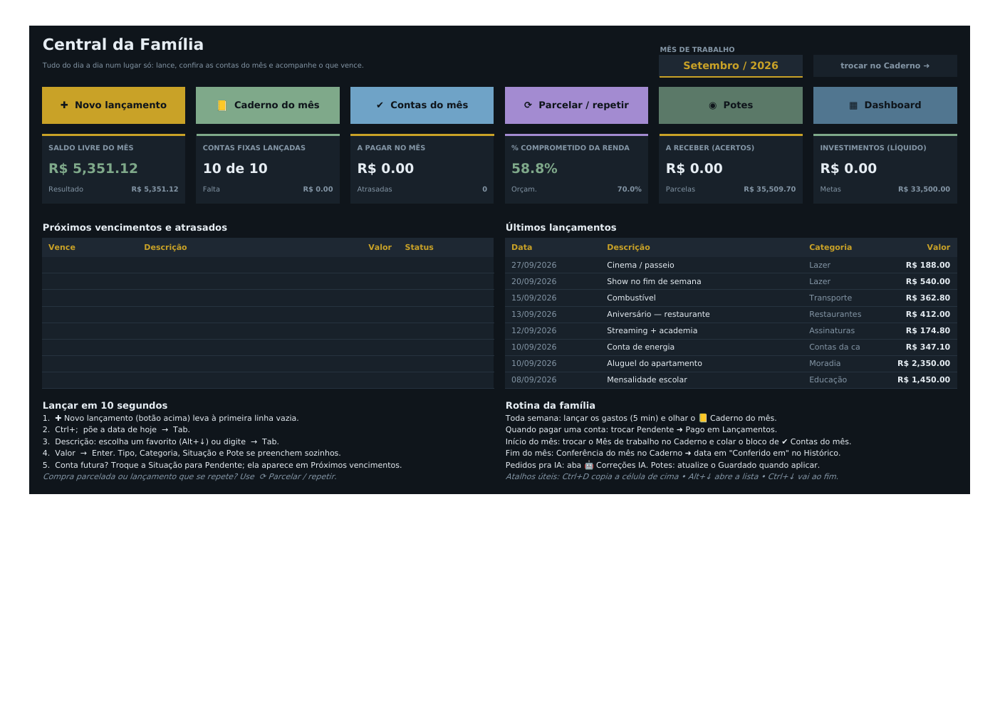
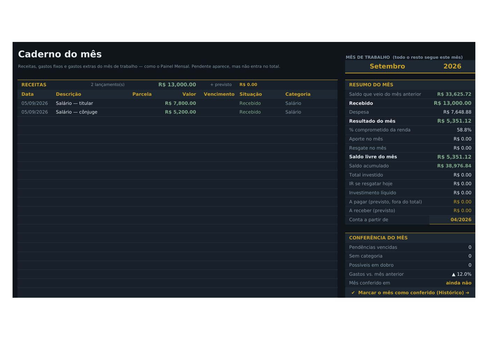

# Finanças Pessoais — Central da Família

*(imagens feitas com os dados de exemplo)*

## No jeito do Plínio

A planilha segue o jeito de visualizar e controlar da **Finanças Família 3.0** e da **Tela do Dinheiro do Plínio**:

- **Tema do Plínio, claro.** Fundo branco e **letra preta** (o que você digita numa linha nova aparece), cabeçalhos em tinta com **latão**, **sereno** (verde) e **brasa** (vermelho), fonte Segoe UI. Células em latão são as que você edita, como o "amarelo = você edita" dos Planos. O visual escuro original continua em `--tema plinio_escuro`.
- **Caderno do mês.** É o antigo Painel Mensal.
  - **Mês de trabalho** fica no topo e todo o resto segue esse mês.
  - Três blocos: **Receitas · Gastos fixos · Gastos extras**, com a grade **Data · Descrição · Parcela · Valor · Vencimento · Situação · Categoria**.
  - **Resumo do mês** com os seus números: Recebido, Gastos fixos, Gastos extras, Resultado, % comprometido da renda, Aporte, Resgate, **Saldo livre do mês**, Total investido, IR, Líquido e o previsto a pagar/receber. Não há saldo acumulado: o que vale é o saldo do mês.
  - **Semáforo:** verde = pago/recebido, amarelo = pendente que vence em até 3 dias, vermelho = atrasado, roxo = Descontar Depois. Pendente aparece, mas **não entra no total**.
  - **Conferência do mês:** pendências vencidas, sem categoria, lançamentos sem data, o que falta categorizar, possíveis lançamentos em dobro e gastos vs. mês anterior. O fechamento é o ritual de declarar que revisou: você escreve a data em **Conferido em**, na aba Histórico.
- **Aporte e Saldo livre.**
  - **Aporte** = aplicações novas da aba Investimentos no mês, sem as marcadas como "Reaplicação" e sem linha de "correção". Confere com o aporte da Tela do Dinheiro.
  - **Resgate** = valores negativos na aba Investimentos, a sua convenção de resgate parcial.
  - **Saldo livre** = Resultado − Aporte + Resgate.
- **Potes 80 / 10 / 7 / 3.** Investimento, Lazer, Manutenção e Vestimenta, com **Guardado** e **% alvo** editáveis. Ao lado ficam o % real, o desvio e o **gasto no ano / no mês de cada pote**. A barra "guardou × gastou" mostra o dinheiro pelos dois lados. O **reequilíbrio** é só sugestão: some o valor gasto nos potes na proporção do alvo, e você aprova editando o Guardado.
- **Categoria ≠ Pote.** A categoria diz *com o quê*; o pote (fundo) diz *de qual dinheiro*. Cada categoria tem um **Fundo padrão** (aba Config), e um gasto sem pote recebe o fundo da categoria, a mesma regra da Base_Dados.
- **Nada fica em Outros.** A aba **Categorizar** junta, por descrição, tudo o que está em Outros ou Sem categoria, com uma sugestão. Escolheu a **Categoria certa**, e todos os lançamentos com essa descrição (e o favorito) mudam juntos; o Pote segue o fundo padrão.
- **Plano 1 e Plano 2**, como na Finanças Família 3.0, numa aba só (**Planos**).
  - **Plano 1:** quando o juro líquido da carteira cobre uma renda mensal. Premissas em latão: CDI, renda a cobrir, aporte (planejado ou média real de 3 meses). Mostra % do CDI médio, IR médio real, patrimônio-alvo, % do caminho e a projeção de 48 meses até INDEPENDENTE.
  - **Plano 2:** renda durável = salário pela carreira (tabela editável) + aluguéis + juro líquido, com projeção de 96 meses até a meta.
- **Investimentos vivos.** Uma linha por aplicação (Data, Banco, % do CDI, Aplicado). Dias, Alíquota IR (regressiva: 22,5% até 180 dias → 15% após 720), Saldo hoje (CDI × % do CDI em dias úteis), IR e Líquido se calculam sozinhos. As linhas vindas do app partem da posição calculada pelo app (**Base**) e seguem rendendo.
- **Histórico do CDI** (aba Planos): cada taxa vale a partir da sua data. Mudou a Selic? Acrescente uma linha; o que já rendeu não muda.
- **Descontar Depois por pessoa.** Com Situação = Descontar Depois, o nome vai em **Descontar de** (visível logo depois de Quem). A aba **Acertos** soma por pessoa o que foi lançado no mês do Caderno, lista lançamento a lançamento, faz o rateio da casa e desconta os **Recebidos**.
- **Mapa completo de categorias.** A aba Atalhos (Favoritos) tem **todas as descrições do histórico** → Tipo, Categoria, Pote. Digitou uma descrição conhecida, e o resto se preenche.
- **🤖 Correções IA.** É o seu canal de pedidos, como a Melhorias IA: você escreve o **Pedido**, a IA implementa, marca **FEITO ✔** e explica em **Como ficou**. Os pedidos são mantidos quando a planilha é gerada de novo.
- **Quem.** Sempre a pessoa definida em `config_pessoal.json` (hoje, uma só), preenchida sozinha (Correção IA #1).

## Preenchimento rápido (o dia a dia)

| Ferramenta | O que faz |
|---|---|
| **Início** | Primeira aba. Tem os botões **✚ Novo lançamento** (leva à primeira linha vazia), **📒 Caderno do mês**, **✔ Contas do mês**, **⟳ Parcelar / repetir**, **◉ Potes** e **◎ Plano 1 e 2**. Mostra saldo livre, contas fixas lançadas, a pagar, % comprometido, a receber e investimentos, além dos **próximos vencimentos e atrasados** e dos **últimos lançamentos**. |
| **Lançamentos** | Você digita **Data** (`Alt+↓` e Enter = hoje), **Descrição e Valor** (e Parcela/Vencimento quando houver). As colunas roxas (Tipo, Categoria, Situação, Pote, Quem, Conta, Forma e o Valor de contas fixas) **se preenchem sozinhas**. Dá para digitar por cima em qualquer linha. Conta, forma, competência etc. ficam recolhidas no **[+]**. |
| **Contas do mês** | Checklist das contas recorrentes do mês (✔ pago, ⏳ pendente, ✖ falta lançar). Ao lado vem um **bloco pronto para colar** com o que falta: copie, vá à primeira linha vazia e cole só os valores (Ctrl+Shift+V). |
| **Parcelar** | Informe descrição, valor, nº de parcelas e a 1ª data: as linhas 1/n, 2/n… saem prontas para colar. O modo "Repetir todo mês" serve para o que se repete. Embaixo ficam os **parcelamentos em andamento**. |
| **Investimentos** | Aplicou? Nova linha: Data, Banco, % do CDI, Aplicado. Reaplicação: escreva "Reaplicação" na Observação. Resgate total: Resgatado = sim; parcial: linha negativa. |

Contas do mês, Parcelar, Orçamento e Investimentos têm uma caixa **Como funciona** na própria aba.

**Lançar em 10 segundos:** ✚ Novo lançamento ➜ `Alt+↓` Enter ou `Ctrl+;` (data de hoje) ➜ Tab ➜ descrição (`Alt+↓` abre a lista) ➜ Tab ➜ valor ➜ Enter.

## Arquivos

- **`build_planilha.py`**: gera a planilha do zero (`pip install openpyxl`).
  - `python build_planilha.py --dados Financas_Plinio_AAAA-MM-DD.xlsx` importa a exportação do app.
  - `python build_planilha.py --dados Financas_Pessoais_Dashboard.xlsx` gera uma **versão nova a partir da própria planilha**. Mantém lançamentos, favoritos, potes, correções IA, respostas da aba Categorizar, meses conferidos, orçamento, premissas e carreira dos Planos, parcelamentos, investimentos e acertos.
  - `python build_planilha.py` sem dados gera **`Financas_Pessoais_Dashboard_EXEMPLO.xlsx`** (dados fictícios).
  - Opções: `--tema plinio` (padrão), `escuro` ou `claro`; `--saida Nome.xlsx`.
- **`Financas_Pessoais_Dashboard_EXEMPLO.xlsx`**: a mesma planilha com dados fictícios.

A planilha com dados reais, a exportação do app e as prévias com dados reais **não vão para o git** (`.gitignore`), porque o repositório é público.

## Abas

| Aba | Para que serve |
|---|---|
| **Inicio** | Central da família: botões, status do mês, vencimentos e últimos lançamentos. |
| **Caderno** | O mês de trabalho em três blocos, com resumo, conferência e semáforo. **É aqui que se troca o mês.** |
| **Lancamentos** | Tabela `tbLancamentos`: onde tudo é lançado. |
| **Categorizar** | O que está em Outros/Sem categoria, por descrição: você escolhe a categoria certa. |
| **ContasMes** | Checklist das contas recorrentes e o bloco do que falta lançar. |
| **Parcelar** | Gerador de parcelas ou de lançamentos repetidos, e os parcelamentos em andamento. |
| **Orcamento** | Meta mensal por categoria e quanto já foi usado. |
| **Potes** | Guardado × gasto dos potes 80/10/7/3 e sugestão de reequilíbrio. |
| **Anual** | Categorias × 12 meses do ano, com minigráficos. |
| **Historico** | Todos os meses: receitas, gasto fixo, gasto extra, resultado, aporte, resgate, saldo livre, % comprometido e **Conferido em**. |
| **Planos** | Premissas, Histórico do CDI, Plano 1 (independência pelos juros, 48 meses) e Plano 2 (renda durável: carreira + aluguéis + juros, 96 meses). |
| **Investimentos** | Uma linha por aplicação; saldo, IR e líquido calculados todo dia. |
| **Acertos** | Descontar Depois do mês por pessoa, recebidos e o rateio passo a passo. |
| **Atalhos** | Favoritos / mapa Descrição → Tipo, Categoria e Pote. |
| **Correções IA** | Os seus pedidos para a IA (2ª aba). |
| Config (oculta) | Listas editáveis: categorias (com Fundo padrão), potes, Quem, contas, cartões, formas, tipos, situações e anos. |
| Calc (oculta) | Cálculos auxiliares. |

## Regra que decide o que entra nos totais

A coluna **Conta no mês?** segue a regra do app: **sim** para receita *Recebida* e para gasto *Pago* ou *Descontar Depois* (Situação em branco também conta); **não** para *Investimento*, *Pendente* e parcelas projetadas. O mês vem da **Data**; se o lançamento é de outro mês, preencha a **Competência**.

## Sobre a importação dos dados reais

- **Categorias em branco:** recebem a categoria mais usada para a mesma descrição, com a Observação "categoria sugerida pelo histórico". Sem nenhum histórico, a linha fica **Sem categoria**.
- **Gastos sem pote:** recebem o Fundo padrão da categoria. "Sem categoria" continua sem pote.
- **Guardado dos potes, pessoas, premissas dos Planos e respostas sugeridas para Categorizar:** vêm do arquivo local `config_pessoal.json` (fora do git, porque o repositório é público). Depois ficam na própria planilha (abas Potes, Config, Plano 1/2 e Categorizar).
- **Lançamento sem data:** entra com a data do dia da atualização, marcado na Observação.
- **Investimentos:** a posição do app no dia da exportação vira a **Base** de cada aplicação, que segue rendendo pelo CDI da aba Plano 1. Os totais e o Aporte/Resgate do mês são fórmulas.

## Detalhes técnicos

- `.xlsx` sem macros. As fórmulas estão em inglês, e o Excel em português as traduz.
- Funções compatíveis: SUMIFS, SUMPRODUCT, INDEX/MATCH, SMALL/LARGE em fórmula matricial, IFERROR, OFFSET. Nada de matriz dinâmica.
- As colunas automáticas de Lançamentos são colunas calculadas da tabela, e o aviso "fórmula inconsistente" fica desligado nas linhas antigas.
- Verificação:
  - **Recálculo:** no LibreOffice, nenhuma das 18.130 fórmulas da planilha com dados reais dá erro.
  - **Histórico:** bate com o "Resumo por mês" do app nos 54 meses.
  - **Caderno:** mostra todos os lançamentos de set/2026, ago/2026 e mar/2023.
  - **Aporte:** confere com a Tela do Dinheiro do Plínio.
  - **Linhas novas:** o preenchimento automático (Quem automático, Pote pela categoria), os blocos para colar, uma aplicação nova, um resgate parcial e uma resposta na aba Categorizar foram testados simulando linhas novas.
  - **Investimentos:** o saldo calculado parte da posição do app e confere com o rendimento esperado (CDI × % do CDI em dias úteis).
  - **Excel de verdade:** os cálculos foram conferidos com a cópia salva por ele.
